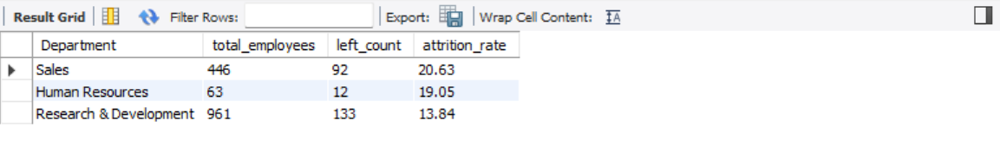
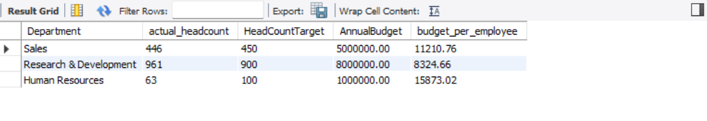
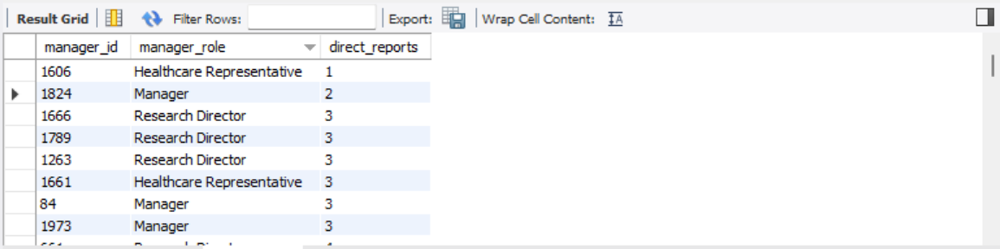
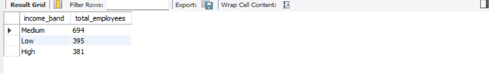
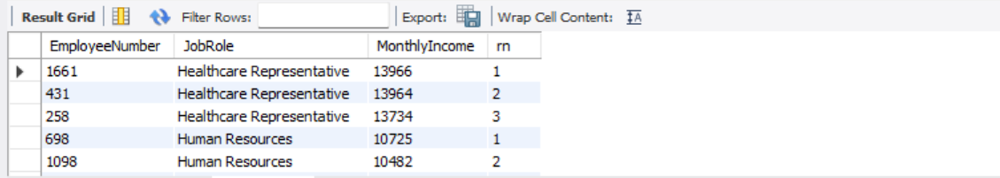
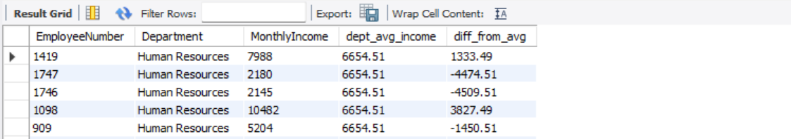
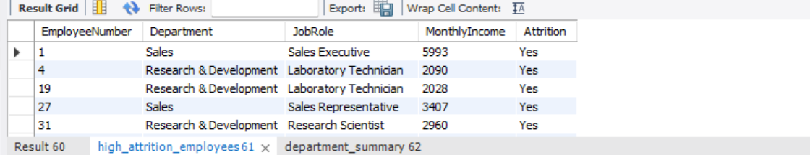
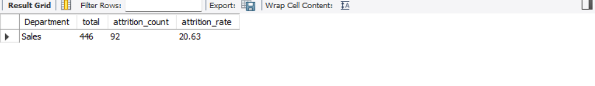

# 📊 HR Employee Attrition Analysis — SQL Project

## 📌 Project Overview
Employee attrition is one of the most expensive problems a company can face — every
employee who leaves costs the business in lost productivity, hiring, and training.
This project analyzes IBM's HR Employee Attrition dataset (1,470 employees) using
**MySQL** to uncover which departments, roles, and salary bands are most at risk,
and to surface patterns that could inform retention strategy.

The project goes beyond basic SELECT queries — it uses joins, self-joins, CTEs,
window functions, views, stored procedures, and a user-defined function to
demonstrate a full range of SQL capabilities.

## 🛠️ Tech Stack


## 📁 Files in this Repository
| File | Description |
|------|-------------|
| `schema.sql` | Schema, Table creation, Data load |
| `queries.sql` | 30 Queries about the bussiness related data |
| `screenshots/` | Query result screenshots referenced below |
| `WA_Fn-UseC_-HR-Employee-Attrition.csv` | Source dataset |

## 🧱 Database Design
- **`employees`** — main table holding all 1,470 employee records (demographics,
  job details, satisfaction scores, salary, attrition status)
- **`department_budget`** — a supporting table created manually to enable JOIN
  practice, holding each department's annual budget and headcount target
- **`ManagerID`** — added to the employees table (not present in the original
  dataset) to demonstrate self-joins and manager-employee hierarchy queries

## 🔑 Key SQL Concepts Demonstrated
- Aggregate functions with `GROUP BY` and `HAVING`
- Subqueries (including correlated subqueries)
- `INNER JOIN` and `LEFT JOIN`
- **Self JOIN** (manager-employee relationships)
- **CTEs** (single and multiple, chained together)
- **Window Functions** — `RANK()`, `ROW_NUMBER()`, `DENSE_RANK()`, running totals
- **Views** for reusable, saved queries
- **Stored Procedures** with parameters
- A **user-defined Function** returning a calculated value

---

## 📈 Key Queries & Insights

### 1. Department-Wise Attrition Rate
*Business question: which department is losing employees the fastest, and does
that team need a retention intervention?*
```sql
SELECT Department,
       COUNT(*) AS total_employees,
       SUM(CASE WHEN Attrition = 'Yes' THEN 1 ELSE 0 END) AS left_count,
       ROUND(100.0 * SUM(CASE WHEN Attrition = 'Yes' THEN 1 ELSE 0 END) / COUNT(*), 2) AS attrition_rate
FROM employees
GROUP BY Department
ORDER BY attrition_rate DESC;
```


### 2. Actual Headcount vs Target, With Budget per Employee
*Business question: which departments are over or under their staffing target,
and how much budget is available per employee in each?*
```sql
SELECT e.Department,
       COUNT(e.EmployeeNumber) AS actual_headcount,
       d.HeadCountTarget,
       d.AnnualBudget,
       ROUND(d.AnnualBudget / COUNT(e.EmployeeNumber), 2) AS budget_per_employee
FROM employees e
JOIN department_budget d ON e.Department = d.Department
GROUP BY e.Department, d.HeadCountTarget, d.AnnualBudget;
```


### 3. Manager Span of Control (Self Join)
*Business question: how many direct reports does each manager have, and are any
managers overloaded?*
```sql
SELECT mgr.EmployeeNumber AS manager_id, mgr.JobRole AS manager_role,
       COUNT(emp.EmployeeNumber) AS direct_reports
FROM employees mgr
JOIN employees emp ON emp.ManagerID = mgr.EmployeeNumber
GROUP BY mgr.EmployeeNumber, mgr.JobRole
ORDER BY direct_reports DESC;
```


### 4. Salary Band Segmentation (CTE)
*Business question: how is the workforce distributed across Low, Medium, and
High income bands?*
```sql
WITH salary_band AS (
    SELECT EmployeeNumber, JobRole, MonthlyIncome,
        CASE
            WHEN MonthlyIncome < 3000 THEN 'Low'
            WHEN MonthlyIncome BETWEEN 3000 AND 8000 THEN 'Medium'
            ELSE 'High'
        END AS income_band
    FROM employees
)
SELECT income_band, COUNT(*) AS total_employees
FROM salary_band
GROUP BY income_band;
```


### 5. Top 3 Highest-Paid Employees per Job Role (Window Function)
*Business question: who are the top earners within each role — useful for
benchmarking pay equity and identifying key talent?*
```sql
SELECT * FROM (
    SELECT EmployeeNumber, JobRole, MonthlyIncome,
           ROW_NUMBER() OVER (PARTITION BY JobRole ORDER BY MonthlyIncome DESC) AS rn
    FROM employees
) ranked
WHERE rn <= 3;
```


### 6. Salary Gap vs Department Average (Window Function)
*Business question: which individual employees are paid significantly above or
below their department's average — a useful signal for pay-equity review?*
```sql
SELECT EmployeeNumber, Department, MonthlyIncome,
       ROUND(AVG(MonthlyIncome) OVER (PARTITION BY Department), 2) AS dept_avg_income,
       ROUND(MonthlyIncome - AVG(MonthlyIncome) OVER (PARTITION BY Department), 2) AS diff_from_avg
FROM employees;
```


### 7. Reusable View — Employees Who Left
*Business question: HR frequently needs a quick list of employees who left — a
view saves this as a one-line lookup instead of rewriting the filter each time.*
```sql
CREATE OR REPLACE VIEW high_attrition_employees AS
SELECT EmployeeNumber, Department, JobRole, MonthlyIncome, Attrition
FROM employees
WHERE Attrition = 'Yes';

SELECT * FROM high_attrition_employees;
```


### 8. Stored Procedure — Department Attrition Lookup
*Business question: HR wants a reusable tool where they can type any department
name and instantly get its attrition summary, without writing SQL each time.*
```sql
DELIMITER //
CREATE PROCEDURE GetDepartmentAttrition(IN dept_name VARCHAR(50))
BEGIN
    SELECT Department,
           COUNT(*) AS total,
           SUM(CASE WHEN Attrition='Yes' THEN 1 ELSE 0 END) AS attrition_count,
           ROUND(100.0 * SUM(CASE WHEN Attrition='Yes' THEN 1 ELSE 0 END) / COUNT(*), 2) AS attrition_rate
    FROM employees
    WHERE Department = dept_name
    GROUP BY Department;
END //
DELIMITER ;

CALL GetDepartmentAttrition('Sales');
```


---

## 💡 Summary of Findings
- Attrition is not evenly spread across departments — some teams lose employees
  at a noticeably higher rate than others, pointing to team-specific retention issues
- A small number of managers carry a disproportionately high number of direct
  reports, which may be linked to burnout and higher attrition in their teams
- Pay gaps exist within the same job role — some employees earn well above or
  below their department average, which is worth a pay-equity review
- Most of the workforce falls into the "Medium" income band, with a smaller
  concentration at the high end

## 📚 Dataset Source
IBM HR Analytics Employee Attrition dataset (publicly available, used for
learning purposes). A `department_budget` table and `ManagerID` column were
added manually to support JOIN and self-JOIN examples not present in the
original data.

## 👤 Author
**Amit Singh**
[LinkedIn](your-linkedin-url) | [GitHub](your-github-url)
